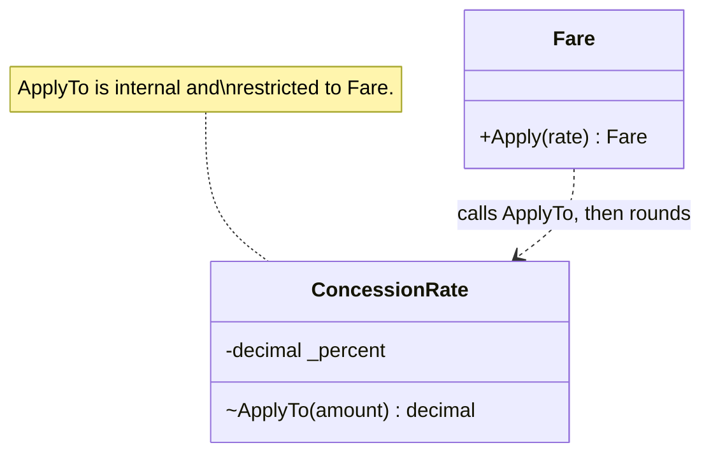

# Collaboration Method

🌍 🇬🇧 English (this file) · 🇫🇷 [Français](CollaborationMethod-fr.md)

## Intent

Collaboration Method opens a member that would otherwise be hidden to one named collaborator, so the exception to
encapsulation is declared at the place it is made.

## Problem

On a transport network a fare is what a passenger pays and a concession rate is the share the operator waives
for pensioners, students or children. The rate knows how to take its share off an amount. It must not know how
the result is rounded, because that is the fare's policy: whether a half-cent goes up, down or to the even
neighbour.

```csharp
public decimal ApplyTo(decimal amount) => amount * (1 - _percent / 100m);   // public: who else calls it?
```

Made public so the fare can use it, the method is open to every use case in the application layer, and any of
them can take a percentage off a bare decimal and round it as it sees fit. That is how a pensioner's fare
comes to differ by a cent between the receipt and the ledger.

## Solution

The article's answer has two halves, and only the second is the annotation.

The first is the visibility. The method is `internal`, and the value objects live in a domain assembly the
application layer cannot see into — the article names hexagonal and Clean Architecture, and warns against
`InternalsVisibleTo` for this, since it would reopen the door to everything.

The second is saying who is let in. A **collaboration method** is an internal method opened to a named
collaborator, and the declaration states the collaborator: the rate hands back an exact amount, and the fare,
which owns the rounding, is the only caller. A second caller then shows up in a review or in an architecture
rule, not in a reconciliation.

The annotation records the intent and does nothing else. The article verifies it with an architecture test
reading the attributes by reflection, so that only declared collaborators call a collaboration method; this
catalogue's attribute carries no such check.

## Structure



## The roles

| Role | Annotation | Applies to | What it carries |
|---|---|---|---|
| CollaborationMethod | `[CollaborationMethod]` | method, property, constructor | A member reachable by one named collaborator and by no other caller. |

One role, with one optional link: `Collaborator`, a `Type`. It is the first link of the catalogue that names a
type which is not a role of the pattern
([ADR-0043](../../for-maintainers/adr/0043-let-a-role-link-to-a-type-that-is-not-a-role.md)). The attribute is
repeatable. The article observes that **many declarations on one method suggest a missing abstraction** the
collaborators share.

Only the restricted member is annotated. The method that calls it — `Fare.Apply` here — is an ordinary method
that asked for nothing: it becomes a collaborator in effect by using the member, and on its own it is nothing
special, so marking it would put a claim on code that never made one. The collaborator is named once, on the
side that opens the door.

The article's own attribute is generic, `[ValueObjectCollaboration<T>]`; this one carries the type as a
property, as every link in the catalogue does.

## The example

From [`CollaborationMethodUsage.cs`](../../../../DesignPatternCatalog.Usage/Reefact/CollaborationMethodUsage.cs).

```csharp
[ValueObject]
public sealed class ConcessionRate {

    // Exact on purpose: rounding is the fare's decision.
    [CollaborationMethod(Collaborator = typeof(Fare))]
    internal decimal ApplyTo(decimal amount) => amount * (1 - _percent / 100m);

}

[ValueObject]
public sealed class Fare {

    public Fare Apply(ConcessionRate rate) =>
        new(Math.Round(rate.ApplyTo(_euros), 2, MidpointRounding.ToEven));

}
```

The division of responsibility is the point and not the attribute. The rate applies its own semantics and
returns an amount that has not been rounded; the fare applies its rounding policy. The article's version uses
`MidpointRounding.ToEven` for the same reason.

## Applicability

The article's guidance is about value objects that must work together without exposing what they need:
*expose what consumers need to know, encapsulate what they need to do*, and prefer a behaviour such as
`fare.Apply(rate)` to computing from exposed fields. Collaboration Method is for the case where one value object
needs another to do part of that work and no consumer should.

## When not to use it

The article gives no criteria for leaving it out, and this page does not invent them. It does give a
signal: a method with several `CollaborationMethod` declarations is probably missing an abstraction, and the
collaborators should be looked at before another declaration is added.

## Advantages

The article gives no list of advantages. The reasons it gives:

* the application layer cannot reach the method at all, and the collaborator is named in the code;
* the responsibilities stay where the knowledge is — the rate applies its semantics, the fare owns rounding;
* the exceptions can be listed, because they are declared.

## Drawbacks

* Without an architecture rule that reads the attribute, it is documentation.
* The link is optional by design: `[CollaborationMethod]` with no collaborator compiles, and says only that
  something is restricted.
* The mechanism leans on assembly boundaries. In a single assembly, `internal` hides nothing from the rest of
  it.

## Relations with other patterns

**`Hydration`** is the other boundary the article draws: dehydration is deliberately not a collaboration API,
so a collaborator asks a value object to do something rather than to give up its values.

## Source

*Advanced Value Objects in .NET*, Reefact, 6 October 2026, `reefact.net` — the section on collaboration between
value objects. The page reports the article's position, which is the maintainer's own.

* [Index entry](../../../generated/catalog-index.md#collaborationmethod-reefact)
* [Generated attribute](../../../../DesignPatternCatalog.Reefact/CollaborationMethod.cs)
* [Example](../../../../DesignPatternCatalog.Usage/Reefact/CollaborationMethodUsage.cs)
