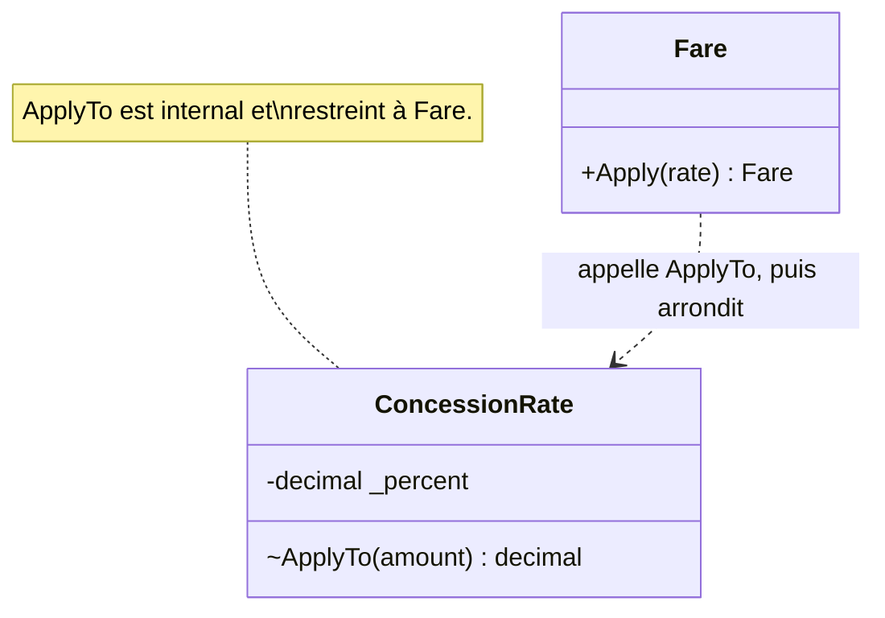

# Collaboration Method

🌍 🇫🇷 Français (ce fichier) · 🇬🇧 [English](CollaborationMethod-en.md)

## Intention

Collaboration Method ouvre à un seul collaborateur nommé un membre qui serait autrement caché, pour que l'exception à
l'encapsulation soit déclarée à l'endroit où elle est faite.

## Problème

Sur un réseau de transport, un tarif est ce que paie un voyageur, et un taux de réduction est la part que
l'exploitant abandonne pour les retraités, les étudiants ou les enfants. Le taux sait retirer sa part d'un
montant. Il ne doit pas savoir comment le résultat est arrondi, car c'est la politique du tarif : un demi-centime
monte-t-il, descend-il, ou va-t-il vers le voisin pair ?

```csharp
public decimal ApplyTo(decimal amount) => amount * (1 - _percent / 100m);   // public : qui d'autre l'appelle ?
```

Rendue publique pour que le tarif puisse s'en servir, la méthode est ouverte à tous les cas d'usage de la
couche applicative, et chacun peut retirer un pourcentage d'un `decimal` brut et l'arrondir à sa façon. C'est
ainsi que le tarif d'un retraité finit par différer d'un centime entre le ticket et le grand livre.

## Solution

La réponse de l'article a deux moitiés, et seule la seconde est l'annotation.

La première est la visibilité. La méthode est `internal`, et les value objects vivent dans un assembly de
domaine que la couche applicative ne peut pas voir — l'article cite l'architecture hexagonale et la Clean
Architecture, et déconseille `InternalsVisibleTo` pour cela, puisqu'il rouvrirait la porte à tout.

La seconde est de dire qui est admis. Une **méthode de collaboration** est une méthode interne ouverte à un
collaborateur nommé, et la déclaration énonce ce collaborateur : le taux rend un montant exact, et le tarif, qui
possède l'arrondi, est le seul appelant. Un second appelant apparaît alors dans une revue ou dans une règle
d'architecture, et non dans un rapprochement comptable.

L'annotation consigne l'intention et ne fait rien d'autre. L'article la vérifie par un test d'architecture qui
lit les attributs par réflexion, de sorte que seuls les collaborateurs déclarés appellent une méthode de
collaboration ; l'attribut de ce catalogue ne porte aucun contrôle de ce genre.

## Structure



## Les rôles

| Rôle | Annotation | S'applique à | Ce qu'il porte |
|---|---|---|---|
| CollaborationMethod | `[CollaborationMethod]` | méthode, propriété, constructeur | Un membre joignable par un seul collaborateur nommé et par aucun autre appelant. |

Un seul rôle, avec un lien optionnel : `Collaborator`, un `Type`. C'est le premier lien du catalogue qui nomme
un type qui n'est pas un rôle du pattern
([ADR-0043](../../for-maintainers/adr/0043-let-a-role-link-to-a-type-that-is-not-a-role.fr.md)). L'attribut est
répétable. L'article observe que **plusieurs déclarations sur une même méthode suggèrent une abstraction
manquante** que les collaborateurs partagent.

Seul le membre restreint est annoté. La méthode qui l'appelle — `Fare.Apply` ici — est une méthode ordinaire qui
n'a rien demandé : elle devient collaboratrice de fait en l'utilisant, et en elle-même elle n'a rien de
particulier ; la marquer ferait peser une affirmation sur du code qui n'en a jamais fait. Le collaborateur est
nommé une seule fois, du côté qui ouvre la porte.

L'attribut de l'article est générique, `[ValueObjectCollaboration<T>]` ; celui-ci porte le type en propriété,
comme tout lien du catalogue.

## L'exemple

Extrait de [`CollaborationMethodUsage.cs`](../../../../DesignPatternCatalog.Usage/Reefact/CollaborationMethodUsage.cs).

```csharp
[ValueObject]
public sealed class ConcessionRate {

    // Exact exprès : l'arrondi est la décision du tarif.
    [CollaborationMethod(Collaborator = typeof(Fare))]
    internal decimal ApplyTo(decimal amount) => amount * (1 - _percent / 100m);

}

[ValueObject]
public sealed class Fare {

    public Fare Apply(ConcessionRate rate) =>
        new(Math.Round(rate.ApplyTo(_euros), 2, MidpointRounding.ToEven));

}
```

Le partage des responsabilités est le sujet, et non l'attribut. Le taux applique sa propre sémantique et rend un
montant non arrondi ; le tarif applique sa politique d'arrondi. La version de l'article utilise
`MidpointRounding.ToEven` pour la même raison.

## Applicabilité

Le conseil de l'article porte sur des value objects qui doivent travailler ensemble sans exposer ce dont ils
ont besoin : *exposer ce que les consommateurs doivent savoir, encapsuler ce qu'ils doivent faire*, et préférer
un comportement tel que `fare.Apply(rate)` à un calcul sur des champs exposés. Collaboration Method sert quand un value
object a besoin d'un autre pour faire une partie de ce travail et qu'aucun consommateur ne le doit.

## Quand ne pas l'utiliser

L'article ne donne aucun critère pour s'en passer, et cette page n'en invente pas. Il donne en revanche un
signal : une méthode portant plusieurs déclarations `CollaborationMethod` manque probablement d'une abstraction, et il
faut regarder les collaborateurs avant d'ajouter une déclaration de plus.

## Avantages

L'article ne donne pas de liste d'avantages. Voici les raisons qu'il donne :

* la couche applicative ne peut pas atteindre la méthode du tout, et le collaborateur est nommé dans le code ;
* les responsabilités restent là où est la connaissance — le taux applique sa sémantique, le tarif possède
  l'arrondi ;
* les exceptions peuvent être listées, puisqu'elles sont déclarées.

## Inconvénients

* Sans règle d'architecture qui lit l'attribut, c'est de la documentation.
* Le lien est optionnel par conception : `[CollaborationMethod]` sans collaborateur compile, et dit seulement que
  quelque chose est restreint.
* Le mécanisme s'appuie sur les frontières d'assembly. Dans un assembly unique, `internal` ne cache rien au
  reste de celui-ci.

## Relations avec d'autres patterns

**`Hydration`** est l'autre frontière que trace l'article : la déshydratation n'est volontairement pas une API
de collaboration, si bien qu'un collaborateur demande à un value object de faire quelque chose plutôt que de
céder ses valeurs.

## Source

*Value Objects avancés en .NET*, Reefact, 6 octobre 2026, `reefact.net` — la section sur la collaboration entre
value objects. La page rapporte la position de l'article, qui est celle du mainteneur.

* [Entrée de l'index](../../../generated/catalog-index.md#restrictedto-reefact)
* [Attribut généré](../../../../DesignPatternCatalog.Reefact/CollaborationMethod.cs)
* [Exemple](../../../../DesignPatternCatalog.Usage/Reefact/CollaborationMethodUsage.cs)
