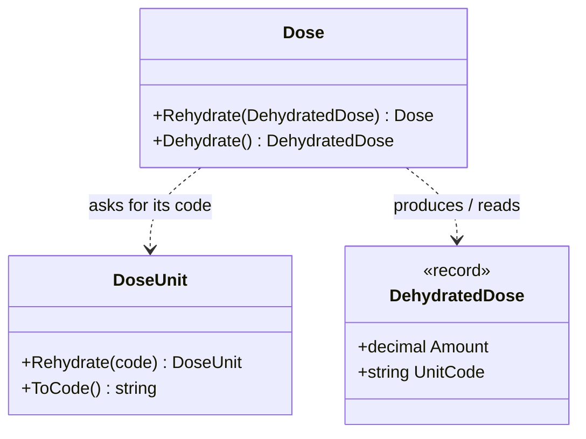

# Hydration

🌍 🇬🇧 English (this file) · 🇫🇷 [Français](Hydration-fr.md)

## Intent

Hydration names the two crossings of a value object's boundary — rebuilding it from plain values and
reducing it back to them — and the object that carries several values across.

## Problem

A prescribed dose is an amount and the unit it is counted in. It is stored, sent to the ward's dispensing
cabinets, and read back from prescriptions written years ago, so it crosses the boundary of the domain all
day, in both directions.

```csharp
var dose = Dose.Of(decimal.Parse(row["amount"]), DoseUnit.Milligram);   // who checked the unit?
cabinet.Send(dose.Amount, dose.Unit.ToString());                        // is ToString a format?
```

Left alone, each crossing is a place where a number and a unit are joined without anyone checking that the
pair means something, and where a value object is turned into text by a method that was never meant to
produce it.

## Solution

The article this page follows draws one line and keeps to it: **the model has exactly one way in and one way
out.**

*In* is rehydration. It builds a value object from its underlying types, enforces the invariants, and knows
nothing about the external format — parsing a JSON string into a `decimal` is somebody else's job, and happens
before. *Out* is dehydration. It produces the underlying representation and is a boundary, not an API for
collaborators: inside the domain it is called only by other dehydration methods, so that a value object that
contains another dehydrates by asking it to.

When the representation is a single value, a value object dehydrates straight to its type. When it is several,
it dehydrates to a **dehydrated object**, typically a sealed record, which holds plain values — never a value
object, and not a mirror of the domain model.

What the annotation does is make the three declarations findable. The article's rules about who may call a
dehydration method, and what a dehydrated object may hold, are architecture tests written over these
attributes; the attributes themselves enforce nothing.

## Structure



`DehydratedDose` holds the unit's code and not the unit: carrying a value object would only have moved the
boundary one step inside.

## The roles

| Role | Annotation | Applies to | What it carries |
|---|---|---|---|
| Rehydrate | `[Hydration.Rehydrate]` | method, constructor | Builds a value object from its underlying values and enforces its invariants. |
| Dehydrate | `[Hydration.Dehydrate]` | method | Produces the underlying values of a value object. |
| DehydratedObject | `[Hydration.DehydratedObject]` | class, struct | Carries several values of one value object across the boundary. |

The roles are not linked to one another: which dehydrated object a value object produces is read from the
method's return type, so a link would only repeat it.

## The example

From [`HydrationUsage.cs`](../../../../DesignPatternCatalog.Usage/Reefact/HydrationUsage.cs).

```csharp
[ValueObject]
public sealed class DoseUnit {

    [Hydration.Rehydrate]
    public static DoseUnit Rehydrate(string code) { /* the known unit with that code, or an error */ }

    [Hydration.Dehydrate]
    public string ToCode() => _code;

}

[ValueObject]
public sealed class Dose {

    [Hydration.Rehydrate]
    public static Dose Rehydrate(DehydratedDose dehydrated) =>
        new(dehydrated.Amount, DoseUnit.Rehydrate(dehydrated.UnitCode));

    [Hydration.Dehydrate]
    public DehydratedDose Dehydrate() => new(_amount, _unit.ToCode());

}

[Hydration.DehydratedObject]
public sealed record DehydratedDose(decimal Amount, string UnitCode);
```

`Dose.Dehydrate` asks the unit for its code through `ToCode`, which is the one place a dehydration method
calls another — and the reason the unit's method is annotated rather than left as a helper.

The rehydration of the unit looks its code up among the known units rather than constructing a new one. The
article puts it as a rule for named values: they are not a closed set of strings, and a unit rebuilt from
`"mg"` must be the same unit as `DoseUnit.Milligram`, not one that merely prints the same.

## Applicability

Everything below is the article's.

**Rehydrate wherever a value object is rebuilt from stored or received data**, so that invariants are enforced
at the only door. The article adds a caution that belongs here: *rehydration is where a historically valid
value must stay reconstructable.* A rule that changed for new operations — a product code now required to have
twelve characters — is not necessarily an invariant of the concept, and a stored code of ten characters must
still come back. If the model truly changed, the boundary adapter decides whether to migrate or to fail
explicitly.

**Use a dehydrated object when the representation is several values**, and give a nested value object that
also has several values its own dehydrated object.

## When not to use it

The article does not set out cases where the convention should be skipped, and this page does not invent
them. What it does say is what the boundary is **not**:

* **`ToString()` is not dehydration.** The article reserves it for diagnostics; it is not a presentation
  format and not a stable serialisation.
* **A dehydrated object is not a mirror of the domain model.** It exists so that values travel together.
* **Serialisation is not dehydration.** How dehydrated data is written — JSON, a table, a message — is the
  decision of an outer layer.

## Advantages

The article gives no list of advantages. These are the reasons it gives for each rule:

* the invariants are enforced at one door, so a value object cannot be built half valid from stored data;
* the domain knows no external format, so changing the format does not touch the model;
* the boundary is declared, so a rule can say who may cross it.

## Drawbacks

* A value object with several values needs a second type, and a nested one needs its own.
* The two ways across are conventions. The article verifies them with architecture tests; without those the
  annotations are documentation.
* A rule that is stricter today than it was when the data was written has to be handled in rehydration, on
  purpose, and not by tightening the constructor.

## Relations with other patterns

**`RestrictedTo`**, on the next page, is its neighbour in the article: collaboration between value objects
opens a method to one named collaborator, while dehydration is deliberately not a collaboration API.

**`ValueObject`** in the *Domain-Driven Design* catalogue is what is being hydrated. This catalogue ships as
its own package and holds no relation to it ([ADR-0027](../../for-maintainers/adr/0027-ship-one-independent-package-per-catalogued-work.md)).

## Source

*Advanced Value Objects in .NET*, Reefact, 6 October 2026, `reefact.net` — the section on rehydration and
dehydration. The page reports the article's position, which is the maintainer's own.

* [Index entry](../../../generated/catalog-index.md#hydration-reefact)
* [Generated attribute](../../../../DesignPatternCatalog.Reefact/Hydration.cs)
* [Example](../../../../DesignPatternCatalog.Usage/Reefact/HydrationUsage.cs)
