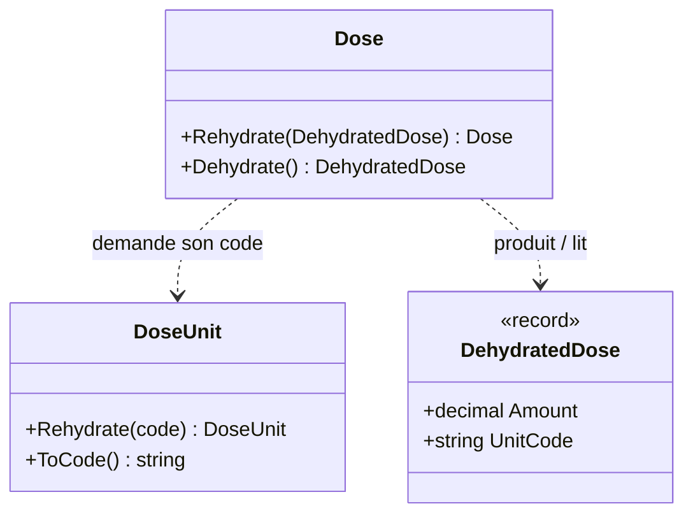

# Hydration

🌍 🇫🇷 Français (ce fichier) · 🇬🇧 [English](Hydration-en.md)

## Intention

Hydration nomme les deux passages de la frontière d'un value object — le reconstruire à partir de valeurs
simples et le réduire à nouveau à elles — ainsi que l'objet qui transporte plusieurs valeurs d'un côté à
l'autre.

## Problème

Une dose prescrite est une quantité et l'unité dans laquelle elle est comptée. Elle est stockée, envoyée aux
armoires de dispensation du service, et relue dans des prescriptions écrites il y a des années : elle franchit
donc la frontière du domaine toute la journée, dans les deux sens.

```csharp
var dose = Dose.Of(decimal.Parse(row["amount"]), DoseUnit.Milligram);   // qui a vérifié l'unité ?
cabinet.Send(dose.Amount, dose.Unit.ToString());                        // ToString est-il un format ?
```

Laissé à lui-même, chaque passage est un endroit où un nombre et une unité sont accolés sans que personne
vérifie que le couple a un sens, et où un value object est transformé en texte par une méthode qui n'a jamais
été faite pour cela.

## Solution

L'article suivi par cette page trace une ligne et la tient : **le modèle a exactement une porte d'entrée et une
porte de sortie.**

*L'entrée* est la réhydratation. Elle construit un value object à partir de ses types sous-jacents, applique
les invariants, et ne sait rien du format externe — transformer une chaîne JSON en `decimal` est l'affaire de
quelqu'un d'autre, et se fait avant. *La sortie* est la déshydratation. Elle produit la représentation
sous-jacente et constitue une frontière, non une API pour les collaborateurs : à l'intérieur du domaine, seules
d'autres méthodes de déshydratation l'appellent, de sorte qu'un value object qui en contient un autre se
déshydrate en le lui demandant.

Quand la représentation est une seule valeur, un value object se déshydrate directement vers son type. Quand
elle en compte plusieurs, il se déshydrate vers un **objet déshydraté**, typiquement un record scellé, qui
porte des valeurs simples — jamais un value object, et qui n'est pas le miroir du modèle du domaine.

L'annotation rend ces trois déclarations repérables. Les règles de l'article sur qui peut appeler une méthode
de déshydratation, et sur ce qu'un objet déshydraté peut contenir, sont des tests d'architecture écrits sur
ces attributs ; les attributs eux-mêmes n'imposent rien.

## Structure



`DehydratedDose` porte le code de l'unité et non l'unité : transporter un value object ne ferait que
déplacer la frontière d'un cran vers l'intérieur.

## Les rôles

| Rôle | Annotation | S'applique à | Ce qu'il porte |
|---|---|---|---|
| RehydrationMethod | `[Hydration.RehydrationMethod]` | méthode, constructeur | Construit un value object à partir de ses valeurs sous-jacentes et applique ses invariants. |
| DehydrationMethod | `[Hydration.DehydrationMethod]` | méthode | Produit les valeurs sous-jacentes d'un value object. |
| DehydratedObject | `[Hydration.DehydratedObject]` | classe, struct | Transporte plusieurs valeurs d'un value object à travers la frontière. |

Les rôles ne sont pas liés entre eux : l'objet déshydraté qu'un value object produit se lit dans le type de
retour de la méthode, si bien qu'un lien ne ferait que le répéter.

## L'exemple

Extrait de [`HydrationUsage.cs`](../../../../DesignPatternCatalog.Usage/Reefact/HydrationUsage.cs).

```csharp
[ValueObject]
public sealed class DoseUnit {

    [Hydration.RehydrationMethod]
    public static DoseUnit Rehydrate(string code) { /* l'unité connue portant ce code, ou une erreur */ }

    [Hydration.DehydrationMethod]
    public string ToCode() => _code;

}

[ValueObject]
public sealed class Dose {

    [Hydration.RehydrationMethod]
    public static Dose Rehydrate(DehydratedDose dehydrated) =>
        new(dehydrated.Amount, DoseUnit.Rehydrate(dehydrated.UnitCode));

    [Hydration.DehydrationMethod]
    public DehydratedDose Dehydrate() => new(_amount, _unit.ToCode());

}

[Hydration.DehydratedObject]
public sealed record DehydratedDose(decimal Amount, string UnitCode);
```

`Dose.Dehydrate` demande son code à l'unité par `ToCode`, ce qui est le seul endroit où une méthode de
déshydratation en appelle une autre — et la raison pour laquelle la méthode de l'unité est annotée plutôt que
laissée comme un utilitaire.

La réhydratation de l'unité cherche son code parmi les unités connues au lieu d'en construire une nouvelle.
L'article en fait une règle pour les valeurs nommées : elles ne forment pas un ensemble fermé de chaînes, et
une unité reconstruite depuis `"mg"` doit être la même que `DoseUnit.Milligram`, pas une unité qui
s'affiche simplement pareil.

## Applicabilité

Tout ce qui suit est de l'article.

**Réhydrater partout où un value object est reconstruit à partir de données stockées ou reçues**, afin que les
invariants soient appliqués à la seule porte. L'article ajoute une précaution qui a sa place ici :
*la réhydratation est l'endroit où une valeur historiquement valide doit rester reconstructible.* Une règle qui
a changé pour les nouvelles opérations — un code produit désormais exigé à douze caractères — n'est pas
forcément un invariant du concept, et un code stocké de dix caractères doit toujours pouvoir revenir. Si le
modèle a vraiment changé, c'est l'adaptateur de frontière qui décide de migrer ou d'échouer explicitement.

**Utiliser un objet déshydraté quand la représentation compte plusieurs valeurs**, et donner à un value object
imbriqué qui en compte plusieurs aussi son propre objet déshydraté.

## Quand ne pas l'utiliser

L'article n'établit pas de cas où il faudrait s'en passer, et cette page n'en invente pas. Ce qu'il dit, c'est
ce que la frontière n'est **pas** :

* **`ToString()` n'est pas de la déshydratation.** L'article le réserve au diagnostic ; ce n'est ni un format
  de présentation ni une sérialisation stable.
* **Un objet déshydraté n'est pas le miroir du modèle du domaine.** Il existe pour que les valeurs voyagent
  ensemble.
* **La sérialisation n'est pas de la déshydratation.** La manière d'écrire les données déshydratées — JSON,
  table, message — relève d'une couche extérieure.

## Avantages

L'article ne donne pas de liste d'avantages. Voici les raisons qu'il donne pour chaque règle :

* les invariants sont appliqués à une seule porte, si bien qu'un value object ne peut pas être construit à
  moitié valide depuis des données stockées ;
* le domaine ne connaît aucun format externe, donc changer de format ne touche pas le modèle ;
* la frontière est déclarée, donc une règle peut dire qui a le droit de la franchir.

## Inconvénients

* Un value object à plusieurs valeurs demande un second type, et un value object imbriqué le sien.
* Les deux passages sont des conventions. L'article les vérifie par des tests d'architecture ; sans eux, les
  annotations sont de la documentation.
* Une règle plus stricte aujourd'hui qu'au moment où la donnée a été écrite doit être traitée dans la
  réhydratation, délibérément, et non en durcissant le constructeur.

## Relations avec d'autres patterns

**`CollaborationMethod`**, sur la page suivante, est son voisin dans l'article : la collaboration entre value objects
ouvre une méthode à un collaborateur nommé, alors que la déshydratation n'est volontairement pas une API de
collaboration.

**`ValueObject`**, dans le catalogue *Domain-Driven Design*, est ce qui est hydraté. Ce catalogue est livré
comme un paquet à part et ne tient aucune relation avec lui
([ADR-0027](../../for-maintainers/adr/0027-ship-one-independent-package-per-catalogued-work.fr.md)).

## Source

*Value Objects avancés en .NET*, Reefact, 6 octobre 2026, `reefact.net` — la section sur la réhydratation et la
déshydratation. La page rapporte la position de l'article, qui est celle du mainteneur.

* [Entrée de l'index](../../../generated/catalog-index.md#hydration-reefact)
* [Attribut généré](../../../../DesignPatternCatalog.Reefact/Hydration.cs)
* [Exemple](../../../../DesignPatternCatalog.Usage/Reefact/HydrationUsage.cs)
